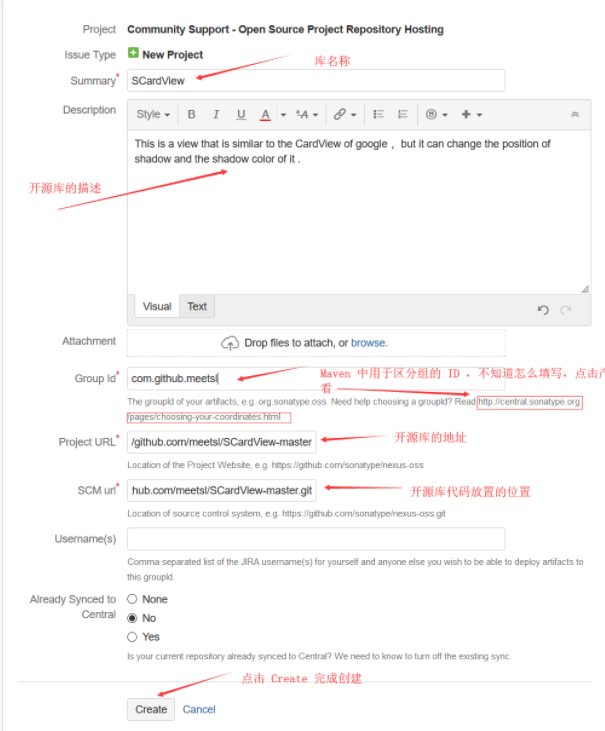
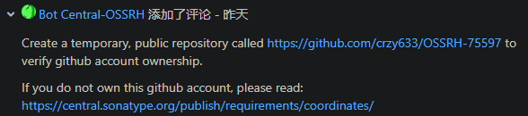
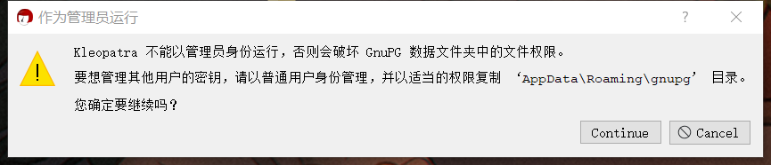
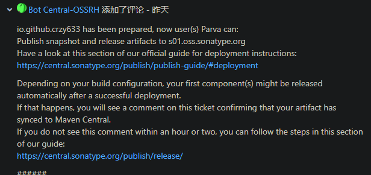

# 发布到Maven中央仓库

## 参考

[【记录】2021使用gradle发布到mavenCentral - 简书 (jianshu.com)](https://www.jianshu.com/p/99f6e5e6a468)

[清晰的教你如何将 Maven 项目上传至 中央仓库以及版本更新 - Spiderman.L - 博客园 (cnblogs.com)](https://www.cnblogs.com/aimqqroad-13/p/9645776.html)

[更新JAR到maven仓库 gpg: keyserver send failed: No name_懒得出风头的博客-CSDN博客](https://blog.csdn.net/qq_29649547/article/details/120181909)


相关链接：

- https://issues.sonatype.org/

- https://s01.oss.sonatype.org/

- https://search.maven.org/

## 步骤一，创建账号、发出Issue

1. 在[sonatype 官网](https://issues.sonatype.org/)中注册账号

2. 点击网页最上面,最中间的"创建"按钮，创建一个Issue 

3. 创建完毕后就等待一段时间，刷新页面。当状态变为“resolved”，然后你就可以使用Gradle上传项目了。

   但我自己在变为"resolved"之前，收到问题反馈

   它要求验证我的账号，具体要求就是要我在github创建一个公开项目，项目名叫`OSSRH-75597`

   我创建好之后，还要在issue页面点响应按钮（具体是什么按钮忘了，自己找一下），然后再等工作人员过来审核，之后该issue就能变成"resolved"了。

## 步骤二 创建GPG秘钥，发布到服务器

头大的一步，跟着步骤走，有问题还百度不到。。最后硬是弄好了。

1. 下载安装一个 Kleopatra（https://www.gpg4win.org/thanks-for-download.html）工具

2. 如果遇到这个弹窗，不用管，Continue

3. `File`-`new Key Pair`-`Create a personal OpenPGP key pair`

4. 创建好之后，双击那一行，打开详细面板，点击Change passphrase设置密码

5. 然后最好也打开详细面板，点一下Generate revocation certificate文件，保存好

6. 点击Export，导出公钥文件，保存好

7. 右键那一行 - `BackupSecretKey` 导出私钥（秘钥）文件，保存好

8. 右键那一行 - `Publish on server` 上传到公共服务器，我这里它默认上传到hkps://hkps.pool-sks-keyservers.net，显示什么No name上传失败。

   解决办法：打开powershell，输入gpg --list-keys可以看到刚才Kleopatra中创建的那一行

   分别输入下面，把公钥发布到这堆服务器上（其中依然会有几个会发布失败，但是有几个能成功就行了！）

   ```
   gpg --keyserver hkp://pool.sks-keyservers.net:11371 --send-keys [你的Key-ID]
   gpg --keyserver keyserver.ubuntu.com --send-keys [你的Key-ID]
   gpg --keyserver keys.openpgp.org --send-keys [你的Key-ID]
   gpg --keyserver pgp.mit.edu --send-keys [你的Key-ID]
   gpg --keyserver keys.gnupg.net --send-keys [你的Key-ID]
   ```


## 步骤三 配置gradle插件，将aar包（或者jar包）发布到maven central

**我这里是发布安卓的library模块，以aar包的形式发布**

**然后我的gradle是7.0以上的版本，7.0以下的版本步骤跟我这里不一样！**

1. 在local.properties中最后添加下面几行

   ```properties
   signing.keyId=刚才获取的秘钥后8位，gpg --list-keys。可以查看刚刚建立的密钥
   signing.password=秘钥密码
   signing.secretKeyRingFile=/Users/wuyanqiang/secring.gpg （就是步骤二，第7点的文件）
   ossrhUsername=sonatype的账号
   ossrhPassword=sonatype的密码
   ```

2. 在模块的`build.gradle`中添加

   ```
   plugins {
       ...
       id 'maven-publish'
       id 'signing'
   }
   
   task androidSourcesJar(type: Jar) {
       archiveClassifier.set("sources")
       from android.sourceSets.main.java.source
   
       exclude "**/R.class"
       exclude "**/BuildConfig.class"
   }
   
   Properties properties = new Properties()
   InputStream inputStream = project.rootProject.file('local.properties').newDataInputStream() ;
   properties.load( inputStream )
   
   ext {
       PUBLISH_GROUP_ID = 'io.github.crzy633'
       PUBLISH_ARTIFACT_ID = 'collapseview'
       PUBLISH_VERSION = '0.0.1'
   }
   
   ext["signing.keyId"] = ''
   ext["signing.password"] = ''
   ext["signing.secretKeyRingFile"] = ''
   ext["ossrhUsername"] = ''
   ext["ossrhPassword"] = ''
   
   File secretPropsFile = project.rootProject.file('local.properties')
   if (secretPropsFile.exists()) {
       println "Found secret props file, loading props"
       Properties p = new Properties()
       p.load(new FileInputStream(secretPropsFile))
       p.each { name, value ->
           ext[name] = value
       }
   } else {
       println "No props file, loading env vars"
   }
   publishing {
       publications {
           release(MavenPublication) {
               // The coordinates of the library, being set from variables that
               // we'll set up in a moment
               groupId PUBLISH_GROUP_ID
               artifactId PUBLISH_ARTIFACT_ID
               version PUBLISH_VERSION
   
               // Two artifacts, the `aar` and the sources
               artifact("$buildDir/outputs/aar/${project.getName()}-release.aar")
               artifact androidSourcesJar
   
               // Self-explanatory metadata for the most part
               pom {
                   name = PUBLISH_ARTIFACT_ID
                   description = 'Collpase View for Android'
                   // If your project has a dedicated site, use its URL here
                   url = 'https://github.com/Crzy633/CollapseView'
                   licenses {
                       license {
                           //协议类型，一般默认Apache License2.0的话不用改：
                           name = 'The Apache License, Version 2.0'
                           url = 'http://www.apache.org/licenses/LICENSE-2.0.txt'
                       }
                   }
                   developers {
                       developer {
                           id = 'Parva'
                           name = 'Parva'
                           email = 'crzy633@gmail.com'
                       }
                   }
                   // Version control info, if you're using GitHub, follow the format as seen here
                   scm {
                       //修改成你的Git地址：
                       connection = 'scm:git:https://github.com/Crzy633/CollapseView.git'
                       developerConnection = 'scm:git:https://github.com/Crzy633/CollapseView.git'
                       //分支地址：
                       url = 'https://github.com/Crzy633/CollapseView.git'
                   }
                   // A slightly hacky fix so that your POM will include any transitive dependencies
                   // that your library builds upon
                   withXml {
                       def dependenciesNode = asNode().appendNode('dependencies')
   
                       project.configurations.implementation.allDependencies.each {
                           println "--- dependency ${it.group} ${it.name} ${it.version}"
                           if(it.group != null && it.group.length() > 0){
                               println "添加 dependency ${it.group} ${it.name} ${it.version}"
                               def dependencyNode = dependenciesNode.appendNode('dependency')
                               dependencyNode.appendNode('groupId', it.group)
                               dependencyNode.appendNode('artifactId', it.name)
                               dependencyNode.appendNode('version', it.version)
                           }
                       }
                   }
               }
           }
       }
       repositories {
           // The repository to publish to, Sonatype/MavenCentral
           maven {
               // This is an arbitrary name, you may also use "mavencentral" or
               // any other name that's descriptive for you
               name = "CollapseView"
   
               def releasesRepoUrl = "https://s01.oss.sonatype.org/service/local/staging/deploy/maven2/"
               def snapshotsRepoUrl = "https://s01.oss.sonatype.org/content/repositories/snapshots/"
               // You only need this if you want to publish snapshots, otherwise just set the URL
               // to the release repo directly
               url = version.endsWith('SNAPSHOT') ? snapshotsRepoUrl : releasesRepoUrl
   
               // The username and password we've fetched earlier
               credentials {
                   username ossrhUsername
                   password ossrhPassword
               }
           }
       }
   }
   signing {
       sign publishing.publications
   }
   ```

   在上面代码中，需要修改的部分有

   ```
   ext {
       PUBLISH_GROUP_ID = 'io.github.crzy633'
       PUBLISH_ARTIFACT_ID = 'collapseview'
       PUBLISH_VERSION = '0.0.1'
   }
   pom {
   	...
   	description = 'Collpase View for Android' // 描述
   	url = 'https://github.com/Crzy633/CollapseView' //github地址
   	developers {
           developer {
               id = 'Parva' // 作者信息，随便填吧
               name = 'Parva' // 作者信息，随便填吧
               email = 'crzy633@gmail.com' // 作者信息，随便填吧
           }
       }
   	scm {
   		connection = 'scm:git:https://github.com/Crzy633/CollapseView.git'
   		developerConnection = 'scm:git:https://github.com/Crzy633/CollapseView.git'
           url = 'https://github.com/Crzy633/CollapseView.git'
   	}
   }
   
   repositories {
   	maven {
   		name = "CollapseView" // Gradle的任务名，随便填，填项目名就好啦
   		def releasesRepoUrl = "https://s01.oss.sonatype.org/service/local/staging/deploy/maven2/"
   		def snapshotsRepoUrl = "https://s01.oss.sonatype.org/content/repositories/snapshots/"
   	}
   }
   ```

   注意，最后两行releasesRepoUrl和snapshotsRepoUrl，在步骤一，sonatype的issue问题，成功变为resolved时，工作人员有提示给两条链接，点进去里面有。

3. gradle 上传操作：
   执行任务：assemble，执行完之后，应该在build/outputs/aar/下生成了xxx-release.aar包了
   再执行任务：publishReleasePublicationToXXXRepository

   发布完成。但又没完全完成。狗头

## 步骤四

进入https://s01.oss.sonatype.org/ ，点右上角登录，输入sonatype的账号密码

如果登录失败，可能你不是这个链接，这个链接在上面sonatype的issue问题，成功变为resolved时，工作人员有提示给两条链接，点进去里面有。

登录之后，可能左侧，Staging Repositories，先close， 再release。就算是发布成功了。


# 最后

需要等一段时间（可能是一天？）审核，就能在https://search.maven.org/ 上搜到了。

百度上说去那个issue回复一下可以加快审核。


# 更新版本

改动代码后，执行任务: assemble生成新的.aar包。

改动PUBLISH_VERSION的值，再执行任务：publishReleasePublicationToXXXRepository。

最后再走一遍步骤四。

